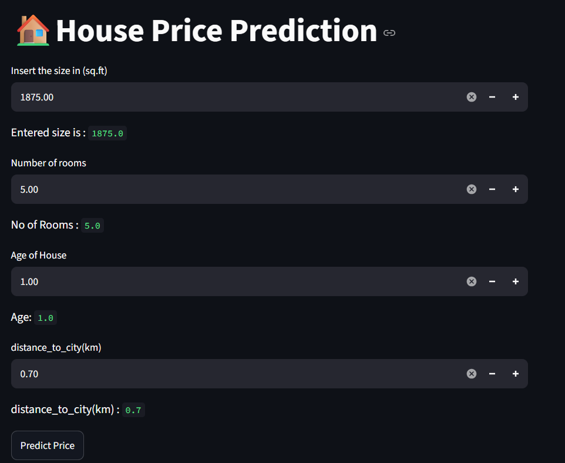
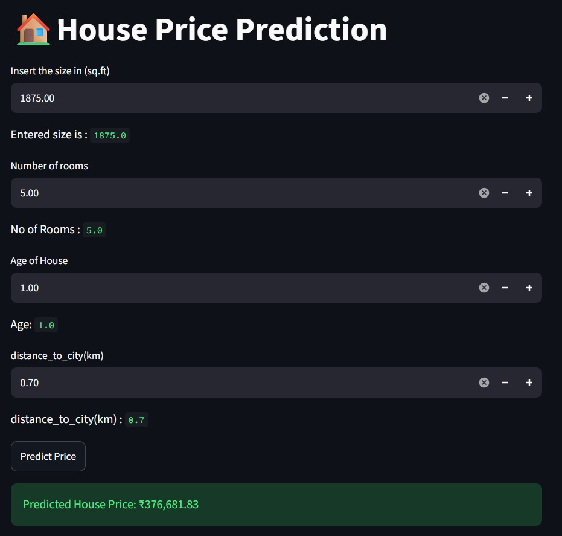

# 🏠 House Price Prediction

A Machine Learning web application that predicts house prices based on property features such as square footage, number of rooms, house age, and distance from the city. The application is built using **Python**, **Scikit-Learn**, and **Streamlit**.

---

## 🚀 Live Demo

👉 **Try the application here:**  
****

---

## 📌 Features

- 🏡 Predict house prices instantly
- 📏 Input house size (Square Feet)
- 🛏️ Specify the number of rooms
- 🏠 Enter the age of the house
- 📍 Include distance from the city
- ⚡ Interactive Streamlit interface
- 🤖 Machine Learning powered predictions

---

## 🛠️ Tech Stack

- Python
- Pandas
- NumPy
- Scikit-Learn
- Streamlit
- Pickle

---

## 📂 Dataset

The project uses a custom housing dataset containing the following features:

| Feature | Description |
|----------|-------------|
| square_feet | Size of the house |
| num_rooms | Number of bedrooms/rooms |
| age | Age of the house |
| distance_to_city(km) | Distance from city center |
| price | Target variable |

---

## 🤖 Machine Learning Pipeline

1. Data Collection
2. Data Preprocessing
3. Feature Selection
4. Train-Test Split
5. Model Training
6. Model Evaluation
7. Model Serialization using Pickle
8. Streamlit Deployment

---

## 📸 Screenshots

### Home Page



### Prediction Result



---

## 📁 Project Structure

```
House-Price-Prediction/
│
├── app.py
├── house.pkl
├── house_prices_dataset.csv
├── House_Price_Prediction.ipynb
├── requirements.txt
├── README.md
│
└── screenshots/
    ├── home.png
    └── prediction.png
```

---

## ⚙️ Installation

Clone the repository

```bash
git clone https://github.com/abhi01-sys/House-Price-Prediction.git
```

Move into the project directory

```bash
cd House-Price-Prediction
```

Install dependencies

```bash
pip install -r requirements.txt
```

Run the application

```bash
streamlit run app.py
```

---

## 📈 Sample Prediction

| Feature | Value |
|----------|------:|
| Square Feet | 1875 |
| Rooms | 5 |
| Age | 1 Year |
| Distance to City | 0.7 km |

### Predicted Price

**₹376,681.83**

---

## 🎯 Future Improvements

- 📊 Visualize feature importance
- 📈 Price trend analysis
- 🗺️ Location-based prediction using maps
- ☁️ Cloud deployment
- 📱 Mobile-friendly UI
- 🤖 Compare multiple regression models

---

## 📚 Libraries Used

- streamlit
- pandas
- numpy
- scikit-learn
- pickle

---

## Author

**Abhishek Nagar**
B.Tech Artificial Intelligence | MITS Gwalior | 5th Semester

- 🔗 [LinkedIn](https://www.linkedin.com/in/abhishek-nagar-a58387226/)
- 🐙 [GitHub](https://github.com/abhi01-sys)
- 📧 nagarab00@gmail.com

---

## ⭐ Show Your Support

If you found this project helpful, please give it a **⭐ Star** on GitHub!

---

*Made with ❤️ by Abhishek Nagar*
